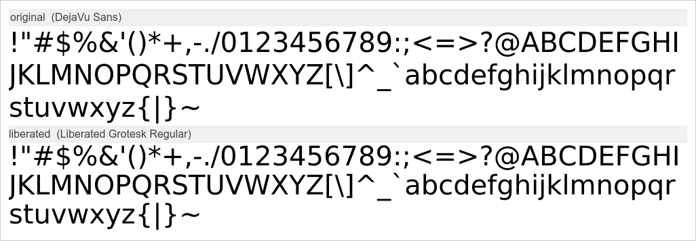
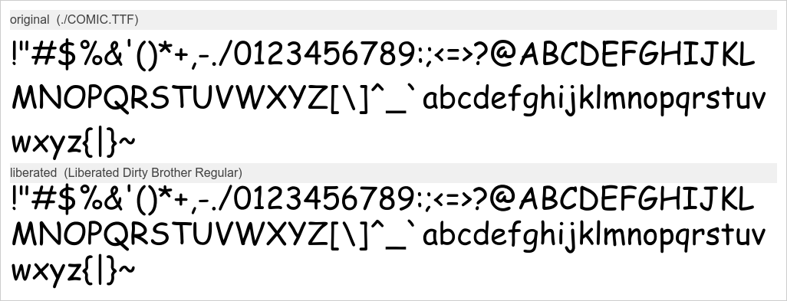

Under US copyright law, typefaces are not eligible for protection, although the software used to implement it (even just a ttf or otf) is.

Thus, to liberate typefaces from the font implementation: **fontliberator** is a tool that automatically clean-rooom reverse-engineers fonts. It renders each glyph of a source font using only the system text renderer as a black-box oracle, autotraces the resulting pixels, and reassembles the outlines into a brand-new `.otf`.

The source font file is never opened, read, or parsed by anything except the system font renderer, which is only touched as a black box (the font goes in, and rasterized pixels come out). Every outline in the output is independently derived from rendered pixels. Obviously, we don't use the original font's Bézier data, metric tables, or hinting program.




## How it works

1. Advance width is measured purely from bitmaps. We render `"H<c>H"` and `"HH"` with the system renderer, trim each to its ink, and compute `advance(c) = width("H<c>H") − width("HH")`. This recovers spacing without needing to read the metric table.

2. The glyph is rendered alone on a fixed-size canvas at a known origin and baseline (ImageMagick's `-annotate` places the text origin on the baseline), then thresholded to a 1-bit bitmap.

3. `potrace` converts the bitmap into SVG cubic Bézier outlines.

4. The script parses the SVG path itself (full `M/L/H/V/C/S/Q/T/A/Z`, absolute and relative), composes potrace's group transform, and maps image pixels into font units: `fx = (px − originX)·U`, `fy = (baselineY − py)·U`, where `U = unitsPerEm / pointsize`.

5. An embedded `fonttools` builder assembles a CFF `.otf` with a `cmap`, horizontal metrics, and vertical metrics derived from the actual traced glyph extents.

### Contour winding

Counters (the holes in `O`, `A`, `@`, …) must wind opposite to their enclosing outer contour for CFF's non-zero fill rule. If skia-pathops is installed, it is used to resolve overlaps and fix winding from an even-odd source. Otherwise, a built-in fallback (nesting-depth + signed-area + contour reversal) handles it.

## Output and limitations

* The output quality generally isn't very good. This is more of a fun legal exercise than a practical tool.
* Produces a single-master, monochrome CFF `.otf` covering the requested characters plus `.notdef`.
* It bakes in whatever hinting and grid-fitting the renderer applied at the chosen point size. Likely not a pixel-perfect metric clone of the original.
* No kerning, ligatures, OpenType features, or hinting are reproduced.
* The `H<c>H` advance heuristic can absorb a font's contextual kerning into the advance for a few glyphs (e.g. after `T`); usually negligible.
* Coverage is whatever the *renderer* draws for a codepoint, including any font fallback the system performs for characters the font lacks.

## Legal analysis

This is not legal advice, and the author is not a legal expert. It is my best-effort understanding. Consult a qualified attorney before relying on this. As stated in the license, there is no warranty for the program, not even the implied warranties of merchantability and fitness for a particular purpose.

### Why this approach exists

In the United States, there is a bit of unusual law. For some reason, typeface designs are not copyrightable. This was settled administratively (37 C.F.R. § 202.1(e) and judicially (*Eltra Corp. v. Ringer*, 579 F.2d 294 (4th Cir. 1978)).

However, font *software* is copyrightable, even a `.ttf` or `.otf`; they are computer programs with originality and creativity. Font software contains outline coordinates, hinting instructions, tables, and code. Courts have protected this as software even though the underlying letterforms are not protected (*Adobe Systems v. Southern Software*, 1998).

Unambiguously, we can legally reproduce a *typeface*, but not the *font*. We accomplish this via standard clean-room reverse engineering tactics.

### The clean room

This tool is a clean-room reimplementor in the classic sense. It never reads the source font at all. It only observes the output of the system renderer (pixels) and independently derives new Bézier curves from those pixels. The new file shares no coordinate data, no program code, and no table structure with the original. It is a fresh expression of an unprotectable design. Under the US framework above, that is the part that keeps clear of the font file's software copyright.

This mirrors typical clean-room/observational reimplementation practice (like the Phoenix BIOS reimplementation); studying externally observable behavior to build an independent, non-copying implementation is generally permissible.

### The copyright status of the outputted `.otf`

This in particular is an unexplored case, but I believe that the outputted `.otf` is uncopyrightable in the US. The typeface design itself is uncopyrightable (obviously). The font software generated by this program is, I believe, also uncopyrightable for at least one of these reasons:

* no human authorship (Thaler v. Perlmutter (D.D.C. 2023, aff'd D.C. Cir. 2025), as well as the Copyright Office's AI guidance)
* slavish manual reproduction of an existing work (*Bridgeman Art Library v. Corel Corp.*, 36 F. Supp. 2d 191 (S.D.N.Y. 1999))

### What this does not protect you from

This tool does not get you out of EULAs, other contracts, trademarks (e.g. you can't call your new font Helvetica even if you exactly reproduce the typeface), patents, or any other restrictions or obligations.

This tool is only relevant to US law.

## Usage

```bash
fontliberator.pl --font <name|path> --family <NewName> --output <out.otf> [opts]
```
e.g.:

```bash
fontliberator.pl -f "DejaVu Sans" -n "Liberated Grotesk" -o liberated.otf --preview
```

Required:

- `-f, --font <name|path>` (system font name (resolved by fontconfig) or a path to a `.ttf`/`.otf`)
- `-n, --family <name>` (family name for the new font. pick your own; the original name is likely trademarked (see *Legal analysis*)
- `-o, --output <path>` (output `.otf` path)

Options:

| Flag                  | Default | Meaning                                            |
|-----------------------|---------|----------------------------------------------------|
| `-s, --style`         | Regular | Style name.                                        |
| `-p, --pointsize`     | 512     | Render size in px; higher = cleaner trace.         |
| `--upem`              | 1000    | Units per em in the output font.                   |
| `--chars`             | ASCII   | Explicit characters to include (default 0x20–0x7E).|
| `--turdsize`          | 2       | potrace: suppress speckles smaller than this.      |
| `--alphamax`          | 1.0     | potrace: corner threshold.                         |
| `--opttolerance`      | 0.2     | potrace: curve optimization tolerance.             |
| `--keep`              | off     | Keep the temp working dir (bitmaps, SVGs, JSON).   |
| `--preview`           | off     | Render an original-vs-liberated comparison image, and, if supported, show it inline via sixel. |
| `-v, --verbose`       | off     | Verbose progress.                                  |
| `-h, --help`          | —       | Help.                                              |

## Dependencies

This is a single Perl script. It shells out to a few external tools.

### Required

* perl
* imagemagick
* potrace
* python3
* fonttools
* fontconfig

### Optional

* skia-pathops

---

The script itself is licensed under the GNU General Public License v3.0. See the LICENSE file for details, and see the *Legal analysis* section for details of the outputs.
